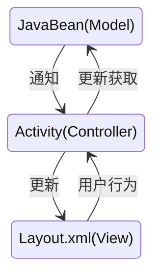
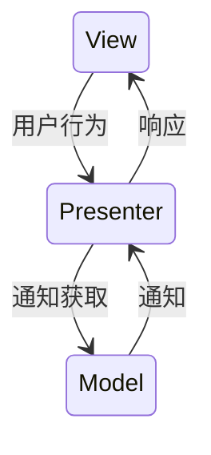
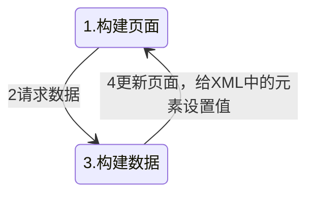
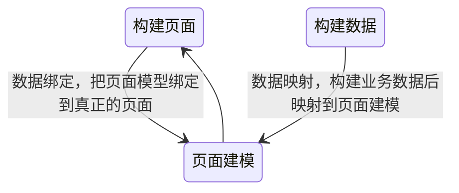
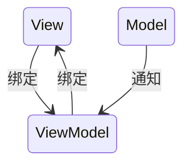

# Android设计模式使用案例

## 如何理解面向对象的编程原则

> 面向对象的程序：由一群互相发送消息的对象组成的程序。
>
> 从六大编程原则可以提炼出：
>
> + 对接口编程而非对实现编程；
> + 优先使用组合而非继承。
>
> 而面向对象的设计模式，就是对此👆🏻的经验总结。

### **单一职责原则：**

（封装性、细化抽象力度、划分职责）

1. 一个类由一组**相关性很高**的数据和方法组成。
2. 💡避免继承灾难。比如如果出现菱形继承（多继承的情况）就是**抽象度不够**的体现。

### **开闭原则：**

（可维护性、可扩展性、抽象变化、稳定性、灵活性（扩展使得更灵活））

1. 对**扩展**开放，对**修改**关闭。
2. 💡面向对象语言里，提高代码可维护性的过程，大多数时候都是在**消除条件分支**语句（if/else，当我们抽象程度不够的时候分支语句繁多也是一种表现）。

### **里式替换原则：**

（可维护性、可扩展性、抽象、复用基类、开闭原则）

1. 任何**基类**出现的地方，**子类**也同样适用，是多态的体现。

2. 也是**开闭原则**的一种实现方案，也是大部分设计模式的基础。满足里式替换原则，子类才能替换基类，才能够说明基类是**真正可复用**的。

3. 典型设计模式：代理模式

   客户只和店员打交道，老板有销售和进货的能力。

   ```mermaid
   classDiagram
   ShopAssistant ..> ShopKeeper
   Seller <|.. ShopAssistant
   Seller <|.. ShopKeeper
   class Seller{
   	<<interface>>
       +sale(p: Product)
   }
   class ShopAssistant{
       +sale(p: Product)
   }
   class ShopKeeper{
   	+sale(p: Product)
   	+stock(p: Product)
   }
   ```

   

### **依赖倒置原则：**

（低耦合、隔绝变化、扩展性、==灵活性==（接口不变的情况下，依赖者和被依赖者都能够自由替换））

1. 依赖**抽象接口**，而非**具体实现**。

   被依赖的地方抽象出一个接口，其他处通过这个接口去依赖它。

   微观上：描述的是类之间的依赖关系。

   宏观上：两个业务模块之间也可以通过接口的方式解耦。（==组件化==就是一个实践）

2. 好处：降低耦合，隔绝类或者模块的变化。

   + 不同业务之间，不被彼此的变化影响。
   + 明确开发、测试人员的职责，提高协作效率。
   + 故障隔离，单独业务故障不影响全局。

### **接口隔离原则：**

（可维护性、可扩展性、隔绝变化、细化抽象力度、**基于接口编程**（依赖倒置原则和接口隔离原则都倡导了这种思想））

1. 使用多个**专门**的接口，优于使用单一的**复合**接口。（抽象出的能力尽可能单一，也可以理解为是接口版本的**单一职责**原则）

   ```mermaid
   classDiagram
         CarBox <|.. Car
         DrivableCar <|.. Car
         Porter..>CarBox
         Driver..>DrivableCar
         class CarBox{
         		<<interface>>
             +load() //装载
         }
         class DrivableCar{
         		<<interface>>
             -drive() //
         }
         class Car{
             +load()
             +drive()
         }
         class Porter{ //搬运工，需要依赖CarBox
             +work()
         }
         class Driver{ //司机，依赖DrivableCar
             +work()
         }
   ```

   ```mermaid
   classDiagram
   Walkable <|.. Dog
   Animal <|.. Dog
   Animal <|.. Bird
   Flyable <|.. Bird
   
   class Walkable{
   	<<interface>>
       +walk()
   }
   class Flyable{
   	<<interface>>
       +fly()
   }
   class Animal{
   	<<interface>>
       -breath()
   }
   class Dog{
       +breath()
       +walk()
   }
   class Bird{
   	+breath()
       +fly()
   }
   ```

2. 不应该强迫类去实现对它们没有意义的抽象（例如拆分成了上面飞、走、动物三种接口，按需实现的例子）。

### **最少知道原则：**

（降低耦合隔绝变化、可维护性、代码可读性、关注点分离）

1. 一个对象应该对其他的对象保持最少的了解（耦合）。
2. **接口隔离**是实现最少知道的手段之一。（例如上面司机和搬运工的例子）
3. 有利于提升代码可维护性，**减少潜在代码bug**；提升可读性。


## 遇到过哪些经典的设计模式的使用案例？

面向对象：26中设计模式 

面向架构：MVC、MVP、MVVM等的架构模式

> 解决了什么问题？应用场景？案例（第三方库中或者项目里的设计）？
>
> 思考提炼出面向对象编程原则。

设计模式：是众前人试错总结积累的一些**最佳实践**；但不是万能的，不可迷信，最重要的是解决问题；使用设计模式是为了**代码复用**、提高代码**可读性**、提升代码**健壮性**。

### **模板方法模式：**

+ 在一个相对**稳定**的框架中，每个步骤的具体行为有差异的情况下，提升程序的**安全性**和**可维护性**（体现了**开闭原则**和**最少知道原则**）。（父类定义算法，细节实现延迟到子类，且由高层模块决策底层模块调用的时机，不会过早的关注细节，到子类实现时关注点分离需要关心的内容减少。）

  **策略模式用组合封装算法，模板方法模式用继承封装算法**。

+ 案例

  + 实现一个视频播放器
  + Activity的生命周期
  + Helo架构中的service声明的接口

### **责任链模式：**

+ 案例

  + View的事件分发

    ```mermaid
    sequenceDiagram
    Activity->>PhoneWindow: Hello John, how are you?
    PhoneWindow->>DecorView: Great!
    DecorView->>ViewGroup: ...
    ViewGroup->>View: ...消费事件
    
    ```

  + OkHttp拦截器

+ 责任链模式使用场景（责任&顺序）

  + **多个**处理者，都有处理同一件事情的能力，找到**最符合要求**（意味着责任链上每个节点的职责都是不同的），且**优先级最高**（节点之间有先后顺序）的一或多个处理者的过程。

+ 好处

  + 提升程序的可扩展性、灵活性。

    我们想要增加一个责任时，只需要根据接口实现一个责任，然后加入到责任链中就可。运行时动态改变责任链节点，或者改变次序，允许动态改变节点责任。

  + 发送者和接收者是解耦的。

  + 遵循：单一职责原则、开闭原则（追加节点的方式）。

### **装饰者模式：**

+ 用于需要动态的，扩展类的能力的情况。

+ 提升程序的：可维护性（避免继承灾难）、扩展性

+ 遵循：组合优于继承、里氏代换原则

+ 案例

  + Context的实现方式

    ContextWrapper对Context既有实现又有依赖关系。

    ```mermaid
    classDiagram
    Context <|.. ContextWrapper
    Context <|.. ContextImpl
    
    ContextWrapper <|-- ContextThemeWrapper
    ContextWrapper <|-- Application
    ContextWrapper <|-- Service
    
    ContextWrapper..>Context
    
    class Context{
    	<<abstract>>
    }
    class ContextWrapper{
        +mBase: Context
    }
    class ContextImpl{
    	
    }
    class ContextThemeWrapper{
        
    }
    class Application{
    	
    }
    class Service{
    	
    }
    ```

### **代理模式：**（安全性、可维护性、性能（例如延迟初始化降低程序的开销））

+ 给对象提供一个**替身**，或者占位，以便控制对真实对象的访问。
  + 可以实现远程的对象代理，以便与远程实例交互。
  + 可以推迟实例化大对象导致的开销——虚拟代理。
  + 和装饰者模式结构类似，但是目的不同
    + 装饰者模式是为了扩展行为
    + 代理模式是为了控制访问
+ 遵循原则：里式代换原则、依赖倒置原则、最少知道原则

### **Android中其他设计模式：**

+ 观察者模式

  BroadcastReceiver、notifyDataSetChanged()、ContentObserver

+ 适配器模式

  RecyclerView Adapter

+ 建造者模式

  AlertDialog.Builder

+ 备忘模式

  onSaveInstanceState

+ 迭代器模式

  Cursor遍历

+ 原型模式

  Intent.clone()

+ 享元模式

  线程池、连接池、Message.obtain()

+ 命令模式

  Handler & MessageQueue

----

### **策略模式：**

+ 策略模式是一种定义一系列算法的方法，所有算法完成的都是**相同的工作，只是实现不同**。并且可以以相同的方式调用所有的算法，减少了各种算法类与使用算法类之间的耦合。

  ```mermaid
  classDiagram
  Strategy <|-- StrategyA
  Strategy <|-- StrategyB
  Strategy <|-- StrategyC
  Context o--> Strategy : 聚合，维护一个对Strategy的引用
  
  class Context{
      +accept()
  }
  
  class Strategy{
      +acceptCash()
  }
  class StrategyA{
      +acceptCash()
  }
  class StrategyB{
      +acceptCash()
  }
  class StrategyC{
      +acceptCash()
  }
  ```

+ 案例

  + [Helo页面模块的跳转](https://omq96c5ejc.feishu.cn/docx/doxcnrxZFGjZGDDYaY88KyzXwmh)
  + 获取不同的Uploader完成上传工作

### 单例模式：

1. Helo记录一些全局可能获取的信息，作为setting使用。


# Android应用工程架构

## 为什么一定要有分层架构？

## MVP为什么比MVC更适合Android开发？

### Android MVC

+ Android语境下的MVC



+ 从xml的设计和Activity的职责来看，MVC是Android官方早期提倡的架构设计模式。
+ 但随着Android平台上越来越多复杂项目的出现，这套架构的问题开始暴露。

### 容易导致Activity代码膨胀

代码行数暴增、职责不单一

+ 静态布局无法帮助Controller分担数据绑定逻辑。（DataBinding、Jetpack Compose）
+ Activity作为页面载体，需要处理页面生命周期中的逻辑。（Jetpack LifeCycle、Jetpack ViewModel）
+ 客户端的Controller需要承担一些异步任务调度的工作。（AsyncTask、Kotlin协程、Kotlin Flow、RxJava）

### Activity实例生命周期问题

+ Activity重建
+ startActivityForResult问题
+ ……

### Activity中的代码为什么不能膨胀？

+ 性能角度：Activity使用期间会驻留内存。
+ 分层架构角度：某个层级过于厚重，不利于解耦。


### Android MVP

View处理显示，Presenter处理业务逻辑，Model承担数据访问。并且**Activity被划入View层**。




### Activity被划入View层的好处

+ 用户行为，统一由View层接收、处理、分发
+ 数据绑定逻辑和页面生命周期的职责，同时被划入View层，Activity和Presenter的职责更加清晰。
+ Presenter实例的生命周期更短了，不必和Activity的生命周期保持一致。

### 依赖倒置原则的体现

+ 依赖抽象接口，而非具体实现
+ 解决实现替换难得问题

## MVVM就是MVP加上DataBinding吗？

### MVVM设计理念

对比MVVM和MVP，除了数据绑定框架，还有哪些差别？

View和ViewModel变成了**绑定关系**，并且ViewModel也不再承担页面逻辑，而是**页面建模**。View部分的实现仍然是xml布局文件和Activity的组合，职责仍然是静态布局（也可以使用Compose框架来替代静态布局）和页面生命周期的管理。View层看上去和MVP没有区别，和ViewModel之间的绑定关系如果通过DataBinding来实现的话，是不是相当于MVP加上DataBinding呢？这关键在ViewModel上，需要理解什么是页面建模，要理解为什么**页面建模和VIew是绑定关系**，而**Presenter和VIew是依赖关系**。

### MVP、MVC解决问题的思路？

是一个闭环式的处理。




### MVVM如何通过页面建模方式解决问题？

+ 对**页面的状态**和**需要展示的数据**，进行建模（例如使用`ViewModel`存储数据）

  所以ViewModel在MVVM中和View就是数据**绑定**的关系，和Model之间的关系就是数据的**映射**。

+ **MVVM解决问题的思路**

  View、ViewModel、Model三个部分的工作没有必然的依赖关系，整体体现了一个**关注点分离**的解决方式，使得构建页面和构建数据没有依赖关系，就能够**并行式**解决问题。

  + （1）页面建模：对页面的状态和需要展示的数据，进行建模
  + （1）构建解决：写布局
  + （2）构建数据：构建业务数据




+ **MVVM中的数据流向** 

  数据源改变

  1. 数据源发生改变的时候会通知VIewModel
  2. ViewModel监听和接收数据源的改变
  3. 被动刷新状态：由于绑定关系的存在，View可以直接接收到ViewModel中的数据变化，而不是由我们主动调用View中的一些改变数据和状态的方法。

  用户交互

  1. 用户改变VIew控件状态：也会被绑定到ViewModel中相应的状态
  2. 数据和状态发生改变：更新Model中的数据源




### **DataBinding在MVVM中的作用**

它会自动绑定View和ViewModel中的数据，**消除大量样板代码**。

但不是实现MVVM唯一的途径。也可以手动编码绑定，或者其他的绑定方式。


### **MVVM重点解决的问题**

+ **关注点分离**，让**页面构建**和**业务建模**之间松耦合，让这两个部分的开发者彼此互不关注，只共同关注页面建模（ViewModel）
+ **数据驱动试图**，ViewModel的职责是帮助View**托管数据和状态**，由ViewModel中的数据变化去**驱动页面变化**，解决View调用方式一致性问题。


### **MVP vs MVVM**

+ 由于**依赖倒置**的存在，MVP更像是一种**接口提炼**方式（单一职责），适应场景更多，而MVVM专注于**有页面的功能**开发。
+ ViewModel是针对View建模，导致ViewModel和View之间存在耦合，ViewModel不利于（不是不能）代码复用
+ DataBinding、Jetpack VIewModel、Jetpack LiveData、Jetpack Compose、Kotlin Flow等官方工具库和官方实践，都是为了解决Android MVC时期存在的种种问题，这些工具，大多符合MVVM（MVI）的思想。


## Jetpack架构给MVVM带来了怎样的改变？


#### Room给MVVM带来了怎样的改变？

+ Room是一个基于SQLite封装的，通过注解处理器实现的ORM（Object Relational Mapping 实例关系映射）库。

+ 开发模式

  + 传统模式：开发者编写逻辑代码 ——> 编译执行
  + 基于建模开发（MBD：Modle-based Development）：开发者进行建模 ——> 据此生成逻辑代码 ——>编译执行

  Room在提供了很多元注解，帮助我们进行业务建模，并将JavaBean中的字段映射到数据库表上。

+ ORM框架对架构的贡献

  + 让操作数据库逻辑对开发者透明，开发者只关心业务建模，减低代码复杂度，减少样板代码。
  + 保证数据一致性，把数据生命周期交给框架处理。


## MVI相关内容

+ [「社区说」《Android 架构演进之 MVI 详解》](https://www.bilibili.com/video/BV1x5411D7sA/?vd_source=343da6a622205d46bc9156a5bdd56709)
+ 

# 组件化

## 做过组件化吗？

## 如何实现组件化


