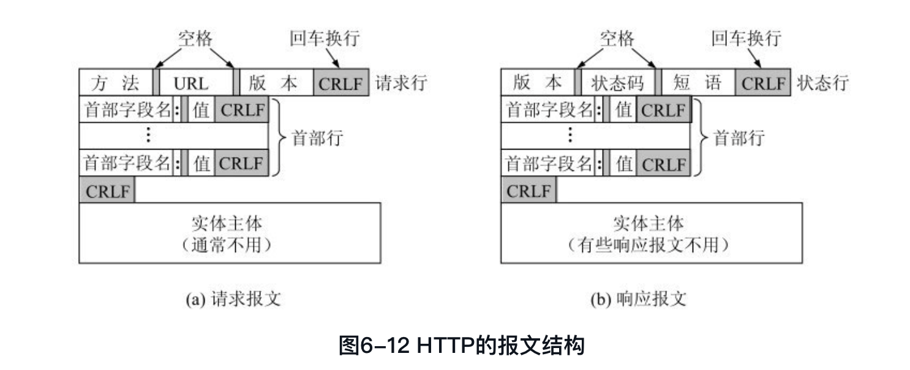

## 应用层

### **域名系统DNS**

#### 域名系统

IP地址长度固定32位（IPv6 128位），而域名长度并不是固定的，机器处理起来比较困难。所以机器处理IP数据报时使用IP地址。

域名系统DNS能够把互联网上的**主机名转换为IP地址**。互联网的域名系统被设计成一个**联机分布数据库系统**，并采用客户服务器方式。DNS使大多数名字都在本地进行解析，仅少量解析需要在互联网上通信，因此DNS系统效率很高。域名到IP地址的解析由分布在互联网上的许多**域名服务器程序**共同完成。

域名到IP地址的解析过程要点：某个应用进程需要把主机名解析为IP地址时，该应用进程调用**解析程序**，并成为DNS的一个客户，把待解析的域名放在DNS请求报文中，以**UDP用户数据报**方式（减少开销）发给本地域名服务器，本地域名服务器查找域名后，把对应的IP地址放在回答报文中返回。应用进程获得目的主机的IP地址后即可进行通信。（若本地域名服务器不能回答该请求，则此域名服务器就暂时成为DNS中的另一个客户，向其他域名服务器发出查询请求。这种过程直至找到能够回答该请求的域名服务器为止。）

#### 互联网的域名结构

用**域名树**来表示互联网的域名系统。域名树的**根没有对应的名字**，根下面的节点是最高一级的**顶级域名**（由ICANN管理），顶级域名可往下划分**二级域名、三级域名等**，域名树的树叶就是单台计算机的名字，不能再继续往下划分子域了。各级域名由上一级域名管理机构管理，这种方法使每一个域名在整个互联网范围内是**唯一**的，并且也最容易设计出一种查找域名的机制。

强调：互联网的名字空间是按照机构的组织划分的，与物理网络无关，与IP地址中的“子网”也无关。

#### 域名服务器

DNS采用划分区的办法（如果让每一级域名都有相应的域名服务器，会使域名服务器数量太多，运行效率降低），一个服务器管辖的范围叫区（区是域的子集），保存该区中所有主机的域名到IP地址的映射。

所以每一个域名服务器都只对域名体系中的一部分进行管辖，根据域名服务器所起作用，有四种类型：

+ 根域名服务器

  **知道所有顶级域名服务器的域名和IP地址**，大部分DNS服务器能就近找到一个根域名服务器查询IP地址。任何一个域名进行解析，只要自己无法解析，就首先要求助于根域名服务器。

  由于根域名服务器采用了任播技术（任播的IP数据包终点是一组不同地点的主机，但具有相同的IP地址，IP数据报交付离源点最近的一台主机），因此当DNS客户向某个根域名服务器的IP地址发出查询报文时，互联网上的路由器就能找到离这个DNS客户最近的一个域名服务器。加快了DNS的查询过程，更合理利用互联网资源。

  注意：很多情况下，根域名服务器并不直接把待查询域名直接转换成IP地址（根域名服务器也没有存放这个信息），而是告诉本地域名服务器下一步**应当找哪一个顶级域名服务器**进行查询。

+ 顶级域名服务器（负责管理所有在顶级域名服务器注册的所有二级域名）

  收到DNS查询请求时，给出相应的回答（最后的结果，或者是下一步应当找的域名服务器的IP地址）。

+ 权限域名服务器（负责一个**区**的域名服务器，区小于等于域）

  当一个权限域名服务器还不能给出最后的查询回答时，就会告诉发出查询请求的DNS客户，下一步应当找哪个权限域名服务器。

+ 本地域名服务器（每一个互联网服务提供者ISP或者一个大学等都可以拥有一个本地域名服务器）

  并不属于域名服务器层次结构。但是一台主机发出DNS查询时，请求报文就发送给本地域名服务器。

  距离用户较近，一般不超过几个路由器的距离，当要查询的主机也属于同一个本地ISP时，该本地域名服务器立即就能将所查询的主机名转换成IP地址，而不需要再去询问其他域名服务器。

为了提高域名服务器的可靠性，DNS域名服务器会把**数据复制**到几个域名服务器来保存，其中一个是**主域名服务器**，其他的是**辅助域名服务器**。当主域名服务器出故障时，辅助域名服务器可以保证DNS的查询工作不会中断。主域名服务器定期把数据复制到辅助域名服务器中，而更改数据只在主域名服务器中进行，这样就**保证了数据一致性**。

**域名解析过程**：

当某一个应用进程需要把主机名解析成IP地址时，该应用进程就调用解析程序，并成为DNS的一个客户，把待解析的域名放在**DNS请求报文**中，以**UDP用户数据报**方式（减少开销）发给本地域名服务器。本地域名服务器在查找域名以后，把对应的IP地址放在回答报文中返回。应用进程获得目的主机的IP地址后就可进行通信。

如果本地域名服务器不能回答该请求，这个域名服务器就暂时成为DNS的另一个客户，并向其他域名服务器（不一定是根域名服务器，在DNS高速缓存的情况下可以更快）发出查询请求，直到找到能够回答该请求的域名服务器为止。

+ 主机向本地域名服务器的查询一般是**递归查询**；本地域名服务器向根域名服务器的查询通常是**迭代查询**（也可以递归查询，取决于最初查询请求报文的设置要求使用哪一种查询方式），当根域名服务器收到本地域名服务器发出的迭代查询请求报文时，要么给出所要查询的IP地址，要么告诉本地域名服务器下一步应该向哪一个域名服务器查询（告诉本地域名服务器下一个域名服务器的IP地址）。

  

+ **DNS高速缓存**：（1）减少根域名服务器的负荷与DNS查询报文数量；（2）域名服务器为每项内容设置计时器并处理过期项以保证高速缓存内容正确；（3）不但本地域名服务器中需要高速缓存，主机中也需要。

+ 使用**TCP**的时候就是DNS的辅助域名服务器从主域名服务器拉取数据进行同步的过程了，这个过程数据量比较大，而且也不要求比较高的时效性，对数据准确性要求又比较高。

**DNS安全问题**：

+ DNS域名劫持、DNS污染等等

**文件传送协议**

+ FTP
+ FTP的工作原理
+ 简单文件传送协议TFTP

**远程终端协议TELNET**

-----

### 万维网WWW

#### **万维网概述**

万维网用链接的方法方便地从互联网上的一个站点访问另一个站点，从而主动地按需获取丰富的信息。是一个**分布式**的**超媒体**系统，是**超文本**系统的扩充。超媒体文档相比只含有文本的超文本文档还包含了图向、声音、视频等等。以客户服务器方式工作。

#### **统一资源定位符URL**

万维网使用统一资源定位符来标志万维网上的各种文档。

+ URL的格式

  URL是用来表示互联网上得到的资源**位置**和访问这些资源的**方法**，是一种抽象的识别方法，要知道一个资源在互联网的什么位置才能够对它进行操作。URL相当于一个文件名在网络范围内的扩展，是与互联网相连的机器上的任何可访问对象的一个指针。由于访问不同对象所使用的协议不同，URL 当中会指出使用什么<协议>来读取某个对象，如http、ftp。<主机>就是该主机在互联网上的域名。

  URL形式：==**<协议>://<主机>:<端口>/<路径>**==

+ 使用最多的URL：使用HTTP的URL

  http://<主机>:<端口>/<路径> 

  对于万维网站点要使用HTTP协议（它的默认端口号是80通常可以省略），路径会指向层次结构的从属页面。
  
  URL的字母不分大小写，用户使用URL并非仅能访问万维网页面，也可以在浏览器通过URL使用其他互联网应用程序，比如FTP等。

#### **超文本传输协议HTTP**

实现万维网上的各种链接使用超文本传输协议HTTP，万维网客户程序和服务器程序之间的交互遵守协议。HTTP是一个**应用层**协议，使用**TCP连接**进行**可靠**的传送。

+ HTTP的操作过程

  HTTP协议规定了浏览器怎么向万维网服务器请求万维网文档，以及服务器怎样把文档传送给浏览器。HTTP是**面向事务**的应用层协议，一系列信息交换是一个不可分割的整体，**HTTP不仅传送完成超文本跳转所需信息，而且传送任何从互联网上得到的信息，如文本、超文本、声音、图像等。**

  每个万维网网点都有一个服务器进程，不断地监听TCP的端口80，以便发现是否有浏览器（万维网客户）向它发出连接请求。HTTP规定在HTTP客户端和HTTP服务器之间的每次交互，都由一个**ASCII码串**构成的请求和一个类似的通用互联网扩充，也就是“类MIME”的响应。

  HTTP使用面向连接的TCP作为运输层协议，保证了数据可靠传输。但是HTTP协议本身是**无连接**的，即虽然使用了TCP连接，但是通信双方在交换HTTP报文之前不需要先建立HTTP连接。

  HTTP协议也是**无状态**的，每一次访问都是独立的，服务器不会记得曾经访问过的客户。这种无状态特性简化了服务器的设计，使得服务器更容易支持大量并发的HTTP请求。

  

  + HTTP/1.0

    非持续连接。每请求一次要有两倍的RTT时间开销（三报文握手以及第三个报文中HTTP请求报文的响应），以及建立一次新的TCP连接所分配的缓存和变量。

  + HTTP/1.1

    使用了TCP的**持续连接**，万维网服务器在发送响应后仍然在一段时间内保持这条连接，使同一个客户和该服务器可以继续在这条连接上传送后续的HTTP请求报文和响应报文。

    HTTP/1.1协议的持续连接有两种工作方式，**非流水线**方式（收到一个响应后才能发出下一个请求，空闲状态多，浪费服务器资源）和**流水线**方式（收到HTTP响应报文之前就能继续发送新的请求报文，空闲时间少，提高了效率）。

  + HTTP/2

+ 代理服务器

  代理服务器又称为**万维网高速缓存**，能够把最近的一些请求和响应暂存在本地磁盘当中，当新的请求到达时候，代理服务器发现当前请求和暂存的请求相同，就返回暂存的响应，而不需要再按URL的地址再次去互联网访问该资源。（代理服务器可以在客户端、服务器端、中间系统上工作）。能够大大减少网络中的通信量，因而减少访问互联网的时延。

  代理服务器有时是作为服务器（当接收浏览器的HTTP请求时），有时却作为客户（当向互联网上的源点服务器发送HTTP请求时）。

+ HTTP的报文结构

  HTTP两类报文：请求报文、响应报文。由于HTTP是**面向文本**的，因此在报文中的每个字段都是一些**ASCII码串**，因而各个字段的长度都是不确定的。

  HTTP的请求报文和响应报文都是三个部分组成，区别在于**开始行不同**。**开始行**用于区分是请求报文还是响应报文；**首部行**用来说明浏览器服务器以及报文主体的一些信息，首部可以有好几行，但是也可以不使用。每一个首部行中都有首部字段名和它的值，还有一空行将首部行和实体主体分开；**实体主体**。

  

  + HTTP请求报文

    请求行：**方法**、**请求资源URL**、**HTTP的版本**；

    首部行：Host（主机域名）、Connection（告诉服务器发送文档后是否释放连接）、User-Agent(用户代理所使用的浏览器)、Accept-Language（用户希望优先得到的文档语言版本）等等。

    实体主体：信息，请求报文中通常不用。

  + HTTP响应报文

    状态行：**HTTP版本**、**状态码**、**解释状态码的简单短语**；

    + 1xx表示**通知信息**，如请求收到了或者正在进行处理。
    + 2xx表示**成功**，如接受了或者知道了。
    + 3xx表示**重定向**，如要完成请求还要采取进一步的行动。
    + 4xx表示**客户的错误**，如请求中有错误语法或者不能完成。
    + 5xx表示**服务器的差错**，如服务器失效无法完成请求。

    首部行：Location（已转移页面新的URL）等等

    实体主体：信息。

+ 在服务器上存放用户的信息

  服务器给客户产生一个**唯一识别码**，并以此作为索引在服务器后端数据库产生一个项目，然后在给客户的HTTP响应报文中添加一个叫做**Set-cookie**的首部行，客户端收到后会在管理的Cookie文件中添加一行（因此Cookie只是一个**本地文本文件**），其中包括这个服务器的主机名和Set-cookie后面给出的识别码。当客户继续访问这个服务器时，每发送一个HTTP请求报文，浏览器就会从其Cookie文件中取出这个主机的识别码，并放到请求报文的首部行Cookie中。
  
  **Cookie可以对用户进行跟踪，只要使用同一个电脑上网，浏览器产生的HTTP请求报文中都携带了同样的Cookie首部行，服务器就能据此验证用户**。（关于Cookie的使用，用户可以在浏览器中自行设置，有权拒绝接收Cookie）

**万维网的文档**

万维网使用超文本标记语言HTML使万维网页面的设计者可以创作不同风格的万维网文档，并可以使用链接从本页面的某处链接到互联网上任何一个万维网页面并显示出来。

**万维网的信息检索系统**

**博客和微博**

**社交网站**

-----

**电子邮件**

+ 电子邮件
+ 简单邮件传送协议SMTP
+ 电子邮件的信息格式
+ 邮件读取协议POP3和IMAP
+ 基于万维网的电子邮件
+ 通用互联网邮件扩充MIME

**动态主机配置协议**

**简单网络管理协议SNMP**

+ 网络管理的基本概念
+ 管理信息结构SMI
+ 管理信息库MIB
+ SNMP的协议数据单元和报文

**应用进程跨越网络的通信**

+ 系统调用和应用编程接口
+ 几种常用的系统调用

**P2P应用**

+ 具有集中目录服务器的P2P工作方式
+ 具有分布式结构的P2P文件共享程序
+ P2P文件分发的分析
+ 在P2P对等方中搜索对象

