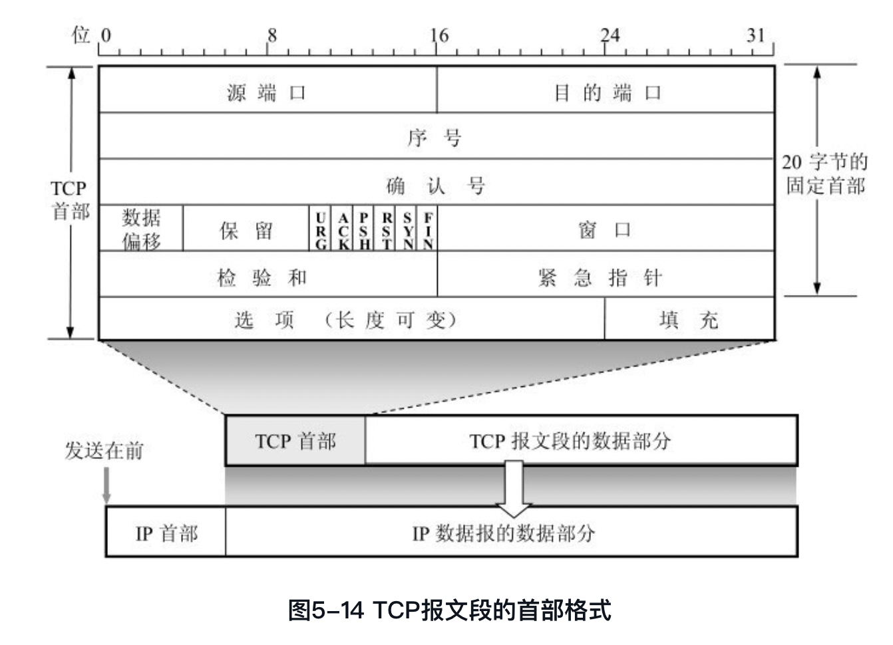
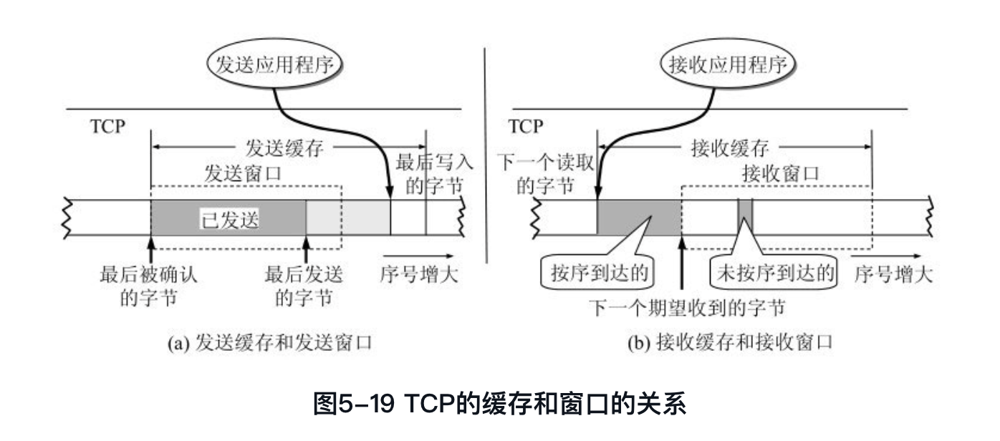
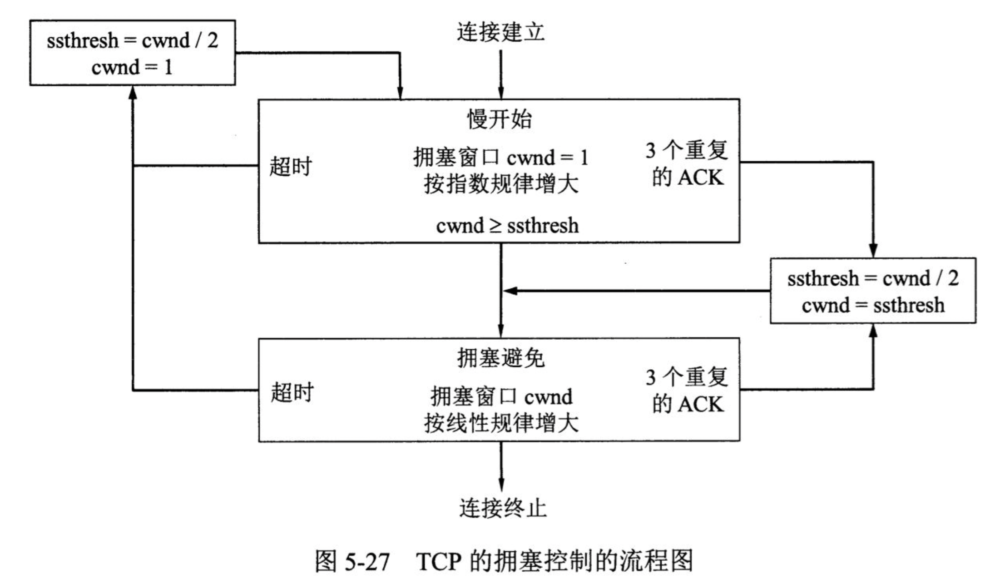
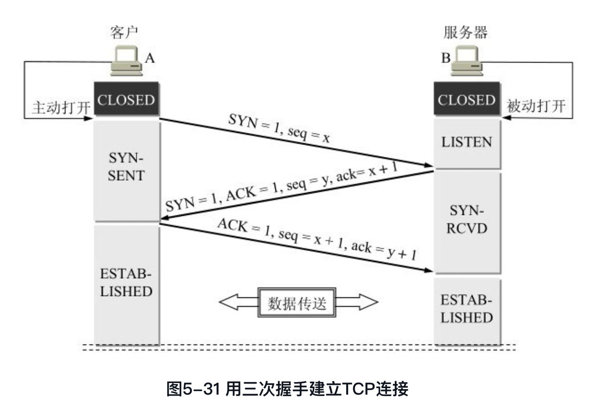
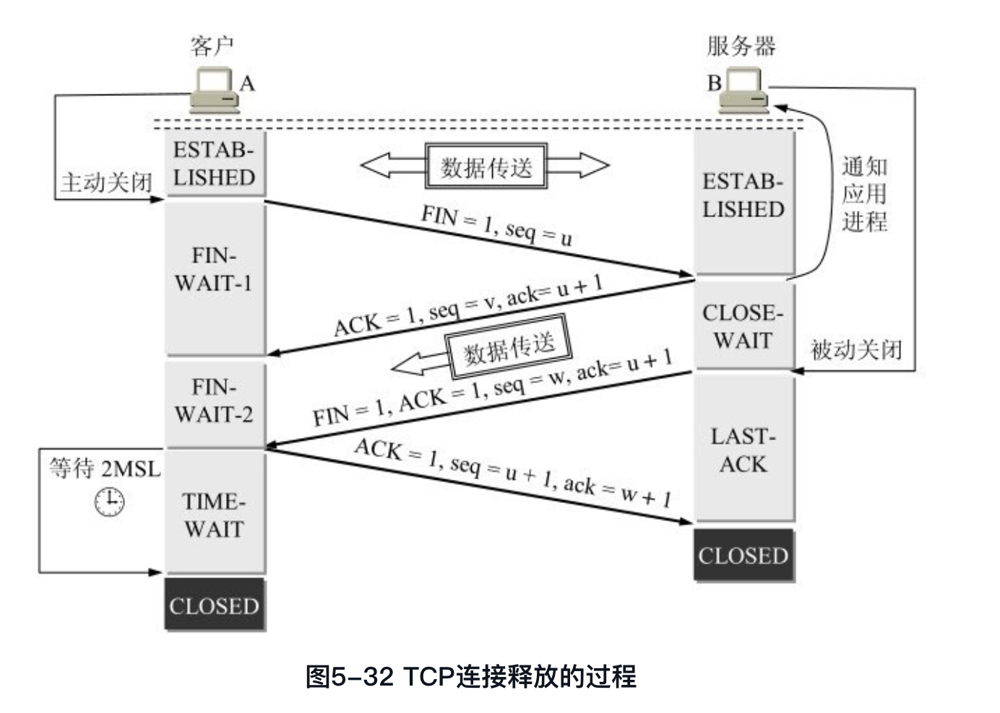
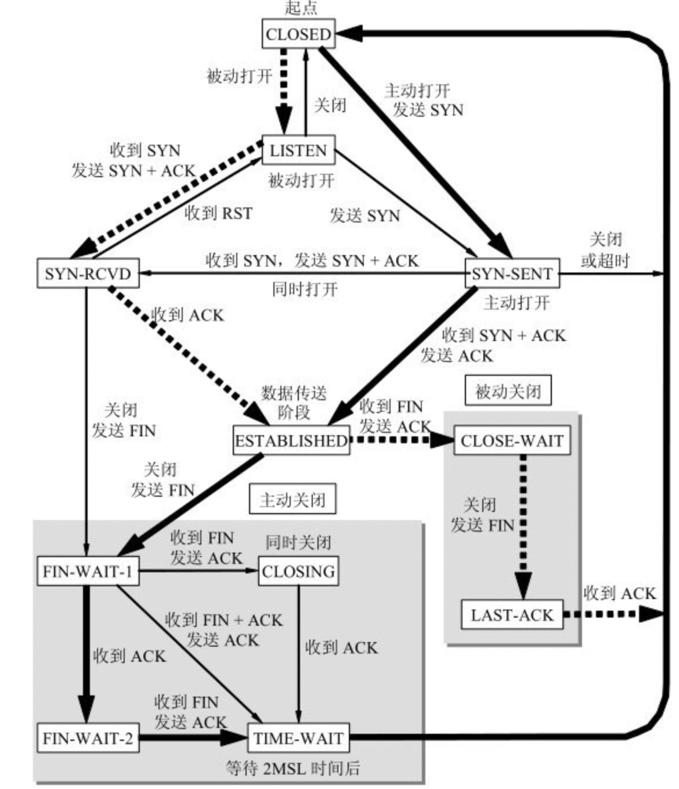

## 运输层 ##

**运输层协议**

+ 进程之间的通信

+ 运输层的复用和分用

  应用层所有应用进程都可以通过运输层再传送到IP层；

  运输层从IP层收到发送给各个应用进程的数据后，必须分别交付指明的各应用进程。

+ 面向连接的TCP和无连接的UDP

+ TCP报文段和UDP用户数据报

+ 运输层的端口

  用一种统一的方法**标记**本计算机应用层的各个进程和运输层交互的层间接口。

+ 服务端使用的端口号（熟知端口号&登记端口号）和客户端使用的端口号（短暂端口号）

## TCP 

#### **传输控制协议TCP**

+ TCP是**面向连接**的传输层协议（应用程序使用TCP协议之前需要建立TCP连接。传送数据完毕后，必须释放已经建立的TCP连接）
+ **点对点**连接
+ **可靠**交付（无差错、不丢失、不重复、按序到达）
+ **全双工**通信（允许通信双方的应用进程在任何时候都能发送数据）
  + 发送缓存&接收缓存

+ 面向**字节流**（TCP把应用程序交下来的数据仅仅看做一串无结构的字节流。1. 接收方的应用程序必须有能力识别接收到的字节流，把它还原成有意义的应用层数据。TCP并不关心应用进程一次把多长的报文发送到TCP缓存中，而是根据对方给出的窗口值和当前网络拥塞的程度来决定一个报文段应该包含多少个字节。2. 如果应用进程传到TCP缓存的数据块太长，TCP就可以划分短一些再传送；反之也可以等待积累足够多字节后再构成报文段发送。）（而UDP发送的报文长度是应用进程给出的。）

TCP报文段先要传送到IP层，加上IP首部以后，再传送到数据链路层，再加上首部和尾部以后，才离开主机发送到物理链路。TCP并不关心应用进程一次把多长的报文发送到TCP缓存中，而是根据接收方给出的**窗口值**和当前网络的**拥塞程度**再来决定一个报文段应该包含多少字节。

#### **TCP的连接**

+ 每一条TCP连接两个**端点**（这个端点不是IP地址，不是应用进程，也不是运输层的协议端口），叫**套接字socket**或者插口。
+ 套接字socket=（IP地址：端口号）

#### **可靠传输的工作原理**

(理想传输条件：传输信道不产生差错&不管发送方以多快的速度发送数据，接收方总是来的及处理收到的数据)而`网络层提供的是不可靠的传输`，传输层就要使用一些**可靠传输协议**：当出现差错时可以让发送方重传出现差错的数据；同时在接收方来不及处理收到的数据时，即时告知发送方适当降低发送数据的速度。

+ 停止等待协议：自动重传请求ARQ（Automatic Repeat reQueset）（学习概念思想就好，运输层并不使用这种协议）

  + 无差错情况
  + 出现差错、确认丢失、确认迟到
  
  超时重传、超时计时器、编号（适用这种确认和重传机制，就可以在不可靠的传输网络上实现可靠的通信）
  
  简单，但是**信道利用率太低**，可以采用**流水线传输**。
  
+ 连续ARQ协议（累积确认，接收方对按序到达的最后一个分组发送确认，回退N）

  + 发送方维持发送窗口：位于发送窗口内的分组都可以连续发送出去，而无需等待对方确认；根据收到的确认，向前滑动发送窗口，以便发送新的分组。（信道利用率就比停止等待方式高了。）
  + 接收方累积确认：不必对收到的分组逐个发送确认，而是在收到几十个分组后，**对按序到达的最后一个分组发送确认**。这样即使确认丢失也不必重传；但是不能向发送方反应出接收方已经正确收到的所有分组信息，可能引起发送方**回退N**的问题（退回来重传已经发送过的N个分组）。

+ 滑动窗口协议（**TCP传输控制协议**的精髓）

#### **TCP报文段的首部格式**

TCP固定首部20字节，选项部分最长40字节。

+ 源端口&目的端口（各2字节）
+ 序号（4字节）：本报文段所发送数据的第一个字节的序号。TCP连接传送的每一个字节都按顺序编号。
+ 确认号（4字节）：期望收到对方下一个报文段的第一个数据字节的序号。也就是如果确认号是N，表明N-1之前的所有数据都已经正确收到。
+ 数据偏移（4位）：单位是32位字（4字节）；实际上支持的是TCP报文段的**首部长度**，侧面表达了TCP首部的最大长度是60字节。
+ 保留（6位）
+ 6位控制位：用来**说明本报文段的性质**
  + 紧急URG
  + 确认ACK：ACK=1时确认号字段才有效；TCP规定，连接建立之后所有传送的报文段都必须ACK=1。
  + 推送PSH
  + 复位RST
  + 同步SYN：连接建立时用来同步序号，SYN=1时表示这是一个连接请求或者连接接收报文。SYN=1&ACK=0（连接请求），SYN=1&ACK=1（连接接受）。
  + 终止FIN：FIN=1，表明此报文段发送方数据已经发送完毕，要求释放运输连接。
+ 窗口（2字节）：以字节为单位，指发送本报文段一方的**接收窗口**，因为接收方的缓存空间是有限制的，所以要明确指出现在允许发送方发送的数据量，窗口值动态变化，作为发送方设置发送窗口的依据。
+ 检验和（2字节）：TCP报文段前面加上12字节的伪首部计算检验和，检测范围包括首部和数据两部分。
+ 紧急指针（2字节）：在**URG=1**时有意义，**指出本报文段中紧急数据的字节数**，紧急数据结束以后就是普通数据。接收方处理紧急数据时会进入紧急状态，当所有紧急数据处理完后，TCP告诉应用进程恢复到正常操作。即使窗口值为零也可以发送紧急数据。
+ 选项（长度可变 <= 40字节，需要对齐填充保证TCP报文段首部是4字节的整数倍）：
  + 最大报文长度
  + 选择确认（SACK）
  + 窗口扩大
  + 时间戳：10字节，主要是时间戳字段（4字节）和时间戳回送回答字段（4字节）。
    + 用来计算往返时间RTT。
    + 用于处理TCP序号超过2^32的情况，防止序号绕回。（使接收方在高速网络状态下，能够将新的报文段和迟到很久的报文段区分开。）
  + ……

#### **TCP可靠传输的实现**

+ 以字节为单位的**滑动窗口**

  + 已经发送但未收到确认的数据均需保存**副本**，以便超时重传时使用。

  + 发送窗口不能超过**接收窗口**数值，发送窗口同时也会受到**网络拥塞程度**的制约。

  + 接收窗口只能对按序收到的数据中的最高序号给出确认（**累积确认**，减少传输开销；**选择确认**，减少不必要的重传）；对不按序到达的数据临时存放在接收窗口，等待字节流中所缺少的字节收到后才按序交付给应用进程。

  + 为了保证可靠传输，发送方只能认为接收方可能没有收到数据，会在超时计时器的控制下**重传数据**，直到收到确认。

  + 窗口和缓存的关系（实际上缓存空间和序号空间都是有限的，循环使用，但是字节数是非常大的）

    

  TCP的通信是**全双工通信**，通信的每一方都在发送和接收报文段，因此每方都有自己的**发送窗口**和**接收窗口**。

+ **超时重传**时间的选择

  重传时间是TCP最复杂的问题之一。采用了一种**自适应**算法：是一个比**加权平均往返时间**RTTs略大的超时重传时间RTO。

  合理策略：报文段每重传一次（即使重传也会采用其往返时间样本），就把超时重传时间RTO增大一些（典型做法是设置为旧的2倍），当不再发生报文重传时，才根据加权计算公式得出超时重传时间。

+ 选择确认SACK

  选择确认是一种能做到**只传送缺少的数据，而不重传已经正确到达接收方的数据**的可行方法。

  如果收到数据的字节序号都在接收窗口之内，那么接收方就先收下这些数据，但是**要把这些信息准确告诉发送方，使发送方不再重传已经收到的数据**。而TCP首部**选项**中就可以提供关于已经收到的字节块的序号边界信息，在接收方和发送方事先商定的情况下，如果要使用选择确认SACK，那在**建立TCP连接**时，就在TCP首部选项中加上“允许SACK“的选项，由于选项部分长度最多40个字节，之后选项中**最多会包含4个字节块的边界信息**（8个边界），和一个指明是SACK的选项的字节，以及一个字节指明这个选项占用多少字节。

  但是SACK文档中并没有指明发送方应该怎么响应SACK，所以**大多数的实现还是重传未被确认的数据块**。

#### **TCP的流量控制**

流量控制就是让发送方发送速率不要太快，要让接收方来的及接收，以免数据丢失。

+ 利用**滑动窗口**可以实现流量控制（利用**可变窗口**进行流量控制）

  发送方的**发送窗口**不能超过接收方给出的**接收窗口**数值。

  TCP窗口的单位是**字节**，不是报文段，接收窗口rwnd，字节序号seq，确认位ACK（=1时确认号字段才有意义），确认号ack。

  如果接收方进行流量控制将窗口值减小到0后，即不允许发送方发送数据，发送方暂停发送的状态会持续到接收方重新发送一个**新的窗口值**为止。（而为了防止这个包含新的窗口值的报文段丢失，造成发送方接收方互相等待的死锁状况，TCP为每一个**连接**都设置了一个**持续计时器**，只要TCP连接一方接收到对方的零窗口通知，就启动持续计时器，时间到期向接收方发送一个**零窗口探测报文**（仅携带一个字节的数据），这时接收方就在确认这个探测报文段时给出现在的窗口值，打破死锁僵局。）

+ TCP传输效率  

  应用进程把数据传送到TCP发送缓存后，剩下的发送任务就由TCP控制了。

  TCP报文段发送时机可以用不同机制控制：1. 缓存中存放的数据**达到MSS**（最大报文长度）字节时，就组装成一个TCP报文段发送。2. 发送方的**应用进程指明**要求发送报文段（即TCP支持的推送push操作）。3. 发送方的**一个计时器期限**到了，就把当前已有的缓存数据装入报文段（不超过MSS）发送。

  如何控制TCP发送报文段的时机仍然是一个较复杂的问题。

  + 糊涂窗口综合征

    糊涂窗口综合症是指当**发送端应用进程产生数据很慢、或接收端应用进程处理接收缓冲区数据很慢**，或二者兼而有之；就会使**应用进程间传送的报文段很小，特别是有效载荷很小**； 极端情况下，有效载荷可能只有1个字节；传输开销有40字节(20字节的IP头+20字节的TCP头) 这种现象。

    发送方和接收方都可能会引发糊涂窗口综合征。

    + 接收方

      接收方进程处理缓存中的数据不及时，一旦腾出一点缓存空间又然后通知一个较小的窗口给发送方；然后发送方会按照这个窗口值发一段较短的数据，循环往复。所以对于**接收方应该避免通知较小的窗口值，可以使用延迟确认的方式等缓存中的数据被清空或者有足够的空间，再告知窗口值**。

    + 发送方

      发送方产生的数据比较慢，每次产生的数据都很小。对于**发送方不应该发送小的报文段，可以使用Nagle算法来控制何时发送**，可以把数据积累成足够大的报文段，或者是达到接收方缓存空间的一半大小。

  + Nagle算法

    Nagle算法是一种**拥塞控制**算法。每次发送少量的数据时，TCP的首部和IP的首部会有很大的开销，这会造成相当高的网络传输代价（这种代价对局域网没有影响，对广域网可能造成拥塞，如糊涂窗口综合征），Nagle算法就是用来解决这种**小包可能导致网络拥塞的问题**。（解决的问题）

    Nagle算法要求，当一个TCP连接中有在传数据（已经发送但还未经确认），小的报文段（长度小于SMSS，SMSS是指发送方能够发送的最大数据段的长度）就不能被发送，**直到所有的在传数据都收到ACK，TCP会将小数据收集整合到一个报文段中发送**。大的报文段不受Nagle算法的影响，实际上Nagle算法对于小的报文段来说就是一个**停止等待**协议。（Nagle算法原理）

    因为要等到所有在传数据收到ACK才发小数据，那么ACK返回的越快，小数据包传输也就越快，如果是时延比较高的广域网中，ACK返回就会越慢，小数据被发送出去的速度也会变慢，这样小数据包就不会加重网络的阻塞。也就是说RTT可以控制发包速率。（Nagle算法为什么有效）

    累积确认与Nagle算法直接结合使用效果会很差，延迟确认会使得接收方推迟发送ACK报文，而使用了Nagle算法的发送方又要等到接收到ACK报文才发送，**导致网络处于空闲状态**。（延时ACK与Nagle算法）
  
    **要求时延尽量小的应用不适合使用Nagle算法**如网络游戏，远程控制等。（Nagle不适合的场景）
  
    

#### **TCP的拥塞控制**

+ 拥塞控制的一般原理
  + **拥塞**：对网络资源（链路容量即带宽、交换结点中的缓存和处理机等）的需求超过了它所能提供的可用部分，网络性能变坏。拥塞趋于恶化，它引起的重传不仅不会缓解网络的拥塞，反而会加剧拥塞。
  + 网络拥塞往往由许多因素引起（比如某个结点缓存容量太小、处理机处理速率太慢等），如果仅仅改善其中某一个方面，又会把瓶颈引向其他地方。问题的实质往往是整个系统的各个部分不匹配，把各个部分**平衡**了才能解决问题。
  + 拥塞控制&流量控制：**拥塞控制**是防止过多数据注入到网络中使得路由器或者链路过载，以网络能承受现有的网络负荷为前提，是一个**全局性**的过程；而**流量控制**往往指点对点通信量的控制，是个**端到端**的问题。
  + 拥塞状态：轻度拥塞、拥塞状态、死锁；
  + 拥塞控制：开环控制（设计网络时提前将发生拥塞的因素考虑到，力求不拥塞）、闭环控制（监测网络拥塞，动态采取行动。主要指标：由于缺少缓存空间而被丢弃的分组百分数、平均队列长度、超时重传的分组数、平均分组时延等，这些指标的上升都意标志着拥塞的增长。）
  
+ TCP的拥塞控制方法      
  
  由于现在的通信线路质量一般很好，传输出差错的而丢弃分组的概率很小了，因此判断网络拥塞的依据就是出现**超时**。
  
  拥塞控制基于窗口（TCP窗口大小的单位是**字节数**），发送方会维持一个叫做**拥塞窗口cwnd**的状态变量。拥塞窗口取决于网络的**拥塞程度**，而只要网络没有出现拥塞，拥塞窗口就可以增大一些，以提高网络利用率；相反就要减小拥塞窗口，减少注入网络的分组数目，缓解拥塞。
  
  发送方窗口的上限值 = Min[rwnd接收方窗口值，cwnd拥塞窗口值]
  
  + 慢开始和拥塞避免
  
    <u>（慢开始算法：）</u>主机开始发送数据时**先探测网络情况**（此时不清楚网络负荷情况，立即把大量数据字节注入网络可能引起网络拥塞），由小到大地增大发送窗口（使分组注入网络的速率更合理）。拥塞窗口没有到达**慢开始门限值**的时候**每收到一个确认报文段**就把拥塞窗口的值最多增加一个**SMSS**（发送方的最大报文段）数值，是一个随着**传输轮次**的**指数增长**的特点。<u>（拥塞避免算法：）</u>而如果到达了慢开始门限值后就开始采用拥塞避免算法，拥塞窗口的大小开始**线性增长**（每经过一个往返时间RTT就把发送方的拥塞窗口cwnd加1个SMSS值），增长速率会缓慢很多，使网络**不容易出现拥塞**（并非完全能够避免拥塞）。
  
    慢开始和拥塞避免执行的过程中，如果遇到“拥塞”情况：
  
    + 当**出现超时**以后，发送方判断为出现了网络拥塞，于是调整门限值(ssthresh=cwnd / 2)并初始化拥塞窗口(cwnd = <=4个SMSS)，**再从慢开始逐渐增大窗口值**。
    + 有时**传送数据丢失**也会引起超时，但这并不是网络拥塞（如果发送方因为迟迟收不到确认产生超时，而判断为拥塞，错位启动慢开始重置拥塞窗口，会降低传输速率）。这种情况需要使用快重传算法（让发送方尽早了解个别报文段的丢失）。
  
  + 快重传和快恢复
  
    **快重传要求接收方对收到的数据立即发送确认**（不要等自己发送数据才捎带），即使收到失序的报文段也要立即发出对已经收到的报文段的重复确认。快重传算法规定，发送方只要一连收到**三个重复确认**，就知道接收方确实没有收到某个报文段，会立即进行重传（**快重传**）就不会超时，发送方也不会因此判断错误认为出现网络拥塞，大大提高网络吞吐量。
    
    所以当出现丢失后，不再启动慢开始，而是执行**快恢复**算法，调整慢开始门限值ssthresh = cwnd / 2（乘法减小），设置拥塞窗口cwnd = ssthresh，并开始执行**拥塞避免**算法（加法增大）。
  
  
  
+ 主动队列管理AQM

  路由器的队列通常按照“先进先出”的处理规则处理到来的分组，但是队列长度总是有限的，因此队列满了以后到达的分组会被丢弃，这是一种**尾部丢弃策略**（很被动）。但是路由器的尾部丢弃会导致一连串分组的丢失，就使发送方出现超时重传，使得TCP进入拥塞控制的**慢开始状态**，结果使TCP连接的发送方突然把数据发送速率降低到很小的数值。甚至还会因为TCP报文段复用网络层IP数据报而影响到很多条TCP连接，使得这些TCP连接同一时间突然进入到慢开始状态的**全局同步**现象（全网通信量会因此突然下降很多，网络恢复后又突然增大很多）。

  为了避免这种现象，提出了通过**主动队列管理AQM**对路由器中的分组队列进行智能管理，而不是简单丢失掉队列尾部的数据。“主动”就是不等到已经发生了网络拥塞后才将所有队列尾部的分组丢弃，而是在检测到网络拥塞的**早期征兆**时就以概率p丢弃个别分组，以**提醒发送方放慢发送速率**，减轻网络拥塞的程度，或让拥塞控制只在个别的TCP连接上进行，避免全局性的拥塞控制。

#### **TCP的运输连接管理**

TCP**面向连接**，在运输层传输TCP报文段，连接中有三个阶段：连接建立、数据传送、连接释放。运输连接管理就是使运输连接的建立和释放都能正常进行。TCP连接建立采用C/S方式（主动发起连接建立的应用进程叫做**客户**，被动等待连接建立的应用进程叫做**服务器**）。

TCP连接建立的过程需要思考的是：如何让每一方都确知对方存在；并且在这个阶段可以双方协商一些参数（最大窗口值、是否使用窗口扩大、是否使用时间戳等）；对运输实体资源进行分配。

+ TCP连接建立

  **三报文握手**

  + 传输报文ACK、SYN、seq、ack

    其中，TCP规定：1. SYN报文段不能携带数据，但要消耗掉一个序号；2. ACK报文段可以携带数据（SYN = 0的前提下），如果不携带数据则不消耗序号。

  + 双方的几种不同状态

    此外，双方都会在最初创建传输控制块TCB，用于存储每一个连接中的一些重要信息。比如TCP连接表，指向发送和接收缓存的指针，指向重传队列的指针，当前发送和接收序号等。

  + 四报文握手的情况

    服务段向客户端回送的报文（连接过程二报文）可以拆成两个报文（先发送一个确认报文段，再发送一个同步报文段，效果一样）。

  + 理解为什么发送方还要进行第三次握手

    防止已失效的连接请求报文段（没有丢失，而是因为滞留于网络中）突然又传送到服务端，如果没有三报文，服务端仅向客户端发送确认就以为新的连接建立了，等待客户端发来数据，白白浪费资源。（因此采用三报文握手，在这种异常情况下，服务端没有收到第三报文，就知道客户端并没有要求建立连接。）

  

+ TCP连接释放

  数据传输结束后，通信双方都可释放连接。

  **四报文握手**
  
  + 传输报文FIN、ACK、seq、ack
  
    TCP规定，FIN报文段即使不携带数据，也要消耗掉一个序号。
  
  + 双方的几种不同状态
  
    图中B向A发送确认以后，A向B方向的连接就释放了，TCP连接处于**半关闭状态**，但是B向A还可以发送数据，A仍要接收。
  
    另外，B向A方向的连接释放，必须经过A时间等待计时器（TIME_WAIT timer）设置的时间2MSL（MSL**最长报文段寿命**Maximum Segment Lifetime）后，A才进入到CLOSED状态，才能开始建立下一个新的连接。当A撤销相应的传输控制模块TCB后，就结束了这次的TCP连接。
  
    B只要收到A的确认，就进入CLOSED状态，同样撤销相应的传输控制模块TCB后结束本次TCP连接。
  
  + 时间等待计时器，理解客户端设置的2MSL的作用。
  
    1. 避免A发送的最后一个ACK报文段**丢失**而无法到达B，使B无法正常进入CLOSED状态。设置计时器，如果遇到丢失，就可以等到B的FIN ACK报文段重传，A也重传一次确认，重新启动2MSL计时器，等候双方最后进入CLOSED状态。
    2. 等待本次连接中产生的报文段从网络中消失，避免在下一个新的连接中出现旧的连接请求报文。
  
  

**保活计时器**：保证客户端服务端建立连接以后**客户端主机出现故障后，服务器能够不一直等待下去而关闭连接**。服务器每收到一次客户端数据，就设置一个保活计时器，时间设置通常是两小时，如果两小时以后没有收到客户端的数据，就发送**探测报文段**，之后每隔75s发送一次，若发送十次都没有响应，就认为客户端出了故障，接着关闭这个连接。

+ TCP的有限状态机

  关于TCP连接当中的各种状态

## UDP

**UDP**

UDP用户数据报只在IP的数据报服务之上增加了**复用和分用**以及**差错检测**的功能。

关于UDP的特点：

+ **无连接**：发送数据不需要建立连接，因此也减少了开销和发送数据之前的时延。
+ 尽最大努力交付：主机因此不需要维护复杂的连接状态了。但一些使用UDP的实时应用，也会对UDP的**不可靠**数据传输适当改进，减少数据丢失。
+ 面向报文：作为发送方，UDP对于应用层交下来的报文，既不合并也不拆分，会**保留这些报文的边界**照样发送不做变动；而作为接收方，UDP对IP层交上的UDP用户数据报，在去除首部以后就原封不动地交付给上层的应用进程。
+ **没有拥塞控制**：因此网络的拥塞不会使源主机的发送速率降低，对于某些实时应用，这一点非常重要。但是当很多源主机都向网络中发送高速率的实时数据时，不使用拥塞控制的UDP可能会引发严重的网络拥塞问题。
+ 支持**一对一、一对多、多对多、多对一**的交互通信。
+ 首部开销小：比起TCP的20个字节的固定首部，UDP首部只有**8个字节**。

**UDP首部格式**

首部字段+数据字段

+ 首部（每个字段长度2字节）

  + 源端口：不需要对方回信可以全用0。
  + 目的端口：终点交付报文必须使用。
  + 长度：UDP用户数据报的长度，最小为仅有首部长度为8的情况。
  + 检验和：检测UDP用户数据报在传输过程中是否有错，有错丢弃（或者附上差错警告上交应用层）。

+ 数据

+ 关于UDP用户数据报的检验和计算。

  UDP的检验和是把**首部和数据部分一起检验**，检验和的计算需要在UDP用户数据报之前**加上12字节的伪首部**构成一个临时的UDP用户数据报，检验和会根据这个临时的UDP用户数据报来计算。

  **伪首部包含的内容**：源IP地址（4字节）、目的IP地址（4）、全零（1）、IP首部中的协议字段的值对于UDP就是17（1）、UDP用户数据报的长度（2）。

  发送方会将UDP用户数据报的数据部分填入全零字节凑成偶数个字节，然后按照**二进制反码**计算出**每16位字**的和，将这个和的二进制反码写入检验和字段，就发送这样的UDP用户数据报。接收方会把收到的UDP用户数据报连同伪首部及可能的填充字节一起，按照二进制反码求这些16位字的和，当无差错其结果应该为1，有差错则丢弃，或者附上差错警告交付上层。

  这种简单的差错检验方法检错能力不强，胜在简单，处理起来较快。

